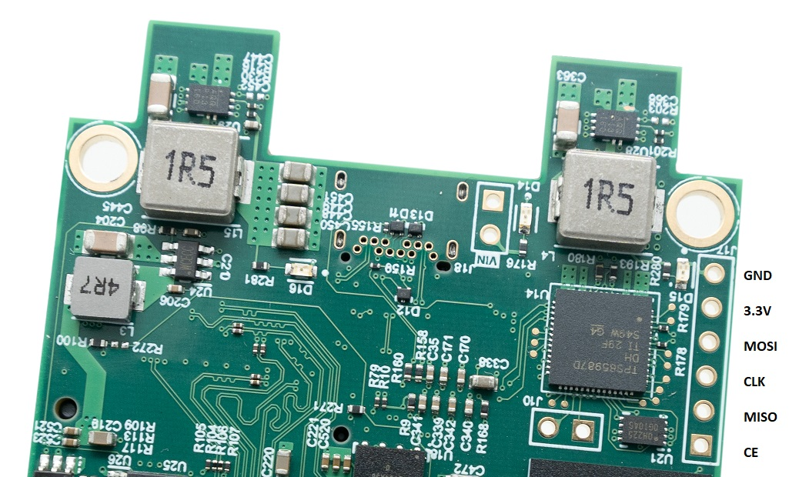

# update USB Type-C firmware
RK1 USB buttom is a full-feature USB Type-C and it has USB2, USB3, Display Port Output and charger port. for enabling all feature we must update its flash firmware manually. In this document, we explain 2 solutions.

- [Flashing with RPi Zero](#Flashing-with-RPi-Zero)
- [Flashing with an external programmer](#Flashing-with-an-external-programmer) 


## Flashing with RPi Zero
we can use RPi Zero as a SPI programmer and Flash USB PD IC Firmware to SPI Flash Connected to it.
First Turn off RK1 There is a connector for flashing USB PD SPI Flash on the bottom of the board. see the below picture.

\
\


Connect these pins of RPi Zero to SPI Flash Connector with some jumper wire.

|Pin Number | Pin Name | Flash pin name|
|-----------|----------|---------------|
| 25        | GND      | GND           |
| 24        | CE0      | CE            |
| 23        | SCLK     | CLK           |
| 21        | MISO     | MISO          |
| 19        | MOSI     | MOSI          |
| 17        | 3.3V     | 3.3V          |


Power On RPi Zero with USB micro connector with PWR IN label. and connect to RPi Zero console and run the below commands.

enable SPI with raspi-config command.

```bash
sudo raspi-config
```

and in "Interfacing Options" menu select "SPI" and select "Yes" for enabling SPI. see this link for more information [Enable SPI Interface on the Raspberry Pi](https://www.raspberrypi-spy.co.uk/2014/08/enabling-the-spi-interface-on-the-raspberry-pi/)

now install "flashrom" app with this command

```bash
sudo apt install flashrom
```

download firmware with this command

```bash
wget https://github.com/functionland/rk1-image/raw/main/firmware/RK1_SPI_flash_firmware.bin
```

now write firmware to SPI flash with this command

```bash
flashrom -p linux_spi:dev=/dev/spidev0.0,spispeed=1000 -w RK1_SPI_flash_firmware.bin
```

if eveythig goes OK these message shown.

```
pi@zero:~/flashrom $ flashrom -p linux_spi:dev=/dev/spidev0.0,spispeed=1000 -w new
flashrom v1.2 on Linux 5.15.61-v7+ (armv7l)
flashrom is free software, get the source code at https://flashrom.org

Using clock_gettime for delay loops (clk_id: 1, resolution: 1ns).
Found Winbond flash chip "W25X05CL" (4096 kB, SPI) on linux_spi.
===
This flash part has status UNTESTED for operations: ERASE WRITE
The test status of this chip may have been updated in the latest development
version of flashrom. If you are running the latest development version,
please email a report to flashrom@flashrom.org if any of the above operations
work correctly for you with this flash chip. Please include the flashrom log
file for all operations you tested (see the man page for details), and mention
which mainboard or programmer you tested in the subject line.
Thanks for your help!
Reading old flash chip contents... done.
Erasing and writing flash chip...
Warning: Chip content is identical to the requested image.
Erase/write done.
```

now you can remove jumper wires and power on RK1

see this link for more information about how to program SPI Flash with RPi Zero
https://www.flashrom.org/RaspberryPi


## Flashing with an external programmer
There is another solution for programming external flash, If you don't have RPI Zero. In this topic we want to use [UsbAsp-flash](https://github.com/nofeletru/UsbAsp-flash) software for programming SPI Flash. this software uses some hardware, and you must buy them.
for our test, we used **CH341a programmer**. you can buy this programmer from [Amazon](https://www.amazon.ca/Programmer-Flasher-Programmable-Circuits-Suitable/dp/B08GCW7WNC/ref=sr_1_1?keywords=ch341a&qid=1673543307&sr=8-1).

connect Programmer yellow pin header to VL805 SPI Flash connector like the previous section. the pin-out are on the back of programmer like below picture.


download VL805 firmware form [this link](https://github.com/functionland/BLOX/raw/main/Electrical/DevKit/documents/vl805-000138a1.bin)

open RK1 firmware in UsbAsp-flash software. 

make sure to select "CH341a" from "Hardware" menu. 

select "W25X05CL" from "IC" -> "SPI" -> "WINBOND" menu.

and click "Program IC" icon.


now you can remove jumper wires and power on Devkit.

after this you can test RK1 bottom USB with USB Docking station.